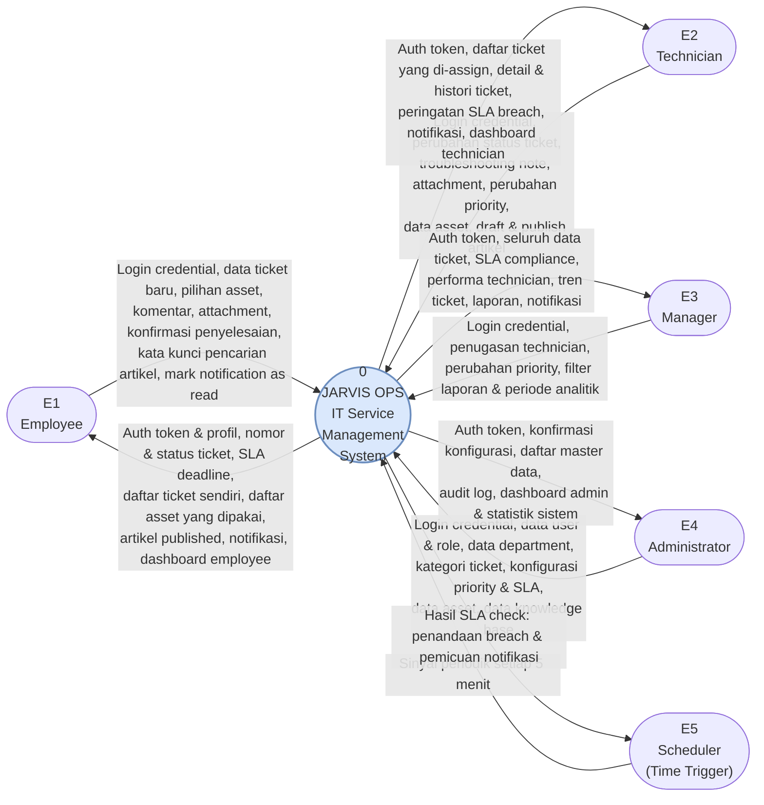

# CONTEXT DIAGRAM (DFD LEVEL 0)

## JARVIS OPS — IT Service Management System

**Document Revision:** 1.0
**Sumber:** `docs/product/PRD.md` (PRD v1.0 + Addendum v1.1)

---

## 1. Ruang Lingkup Sistem

Context diagram menggambarkan JARVIS OPS sebagai **satu proses tunggal** yang berinteraksi
dengan external entity di luar batas sistem. Tidak ada data store yang digambarkan pada level ini.

Batas sistem mencakup:

- Next.js frontend
- Laravel REST API (business logic, authorization, SLA, notification, audit)
- MySQL database
- Laravel Storage (file attachment)
- Laravel Scheduler (SLA background job)

---

## 2. External Entity

| Kode | External Entity          | Peran                                                                     |
| ---- | ------------------------ | ------------------------------------------------------------------------- |
| E1   | Employee                 | Pelapor masalah IT, pemilik asset, pembaca knowledge base                 |
| E2   | Technician               | Penangan ticket, penulis knowledge article, pengelola asset               |
| E3   | Manager                  | Assignment ticket, monitoring SLA & performa tim                          |
| E4   | Administrator            | Konfigurasi sistem, user/role/department/category/priority, audit log     |
| E5   | Scheduler (Time Trigger) | Pemicu waktu (setiap 5 menit) untuk SLA check — bukan aktor manusia       |

> Catatan: Scheduler diletakkan sebagai external entity karena bertindak sebagai **time-based
> trigger** yang berada di luar interaksi pengguna. Beberapa notasi menempatkannya sebagai
> proses internal; pada dokumen ini dipilih sebagai external entity agar aliran pemicu SLA
> terlihat eksplisit.

---

## 3. Context Diagram

---

## 4. Daftar Aliran Data (Data Flow)

### 4.1 Employee (E1)

| Arah    | Aliran Data                                                                                              |
| ------- | -------------------------------------------------------------------------------------------------------- |
| E1 → 0  | Login credential (email, password)                                                                       |
| E1 → 0  | Data ticket baru (title, description, category, priority, asset opsional)                                 |
| E1 → 0  | Komentar ticket, file attachment (JPG/JPEG/PNG/PDF, maks 5 MB)                                            |
| E1 → 0  | Konfirmasi penyelesaian ticket (RESOLVED → CLOSED) atau penolakan (RESOLVED → IN_PROGRESS)                |
| E1 → 0  | Kata kunci pencarian knowledge article, permintaan mark notification as read                              |
| 0 → E1  | Auth token & data profil                                                                                 |
| 0 → E1  | Nomor ticket, status ticket, SLA deadline                                                                |
| 0 → E1  | Daftar ticket milik sendiri (paginated), histori penanganan                                              |
| 0 → E1  | Daftar asset yang di-assign kepada dirinya                                                               |
| 0 → E1  | Knowledge article berstatus Published                                                                    |
| 0 → E1  | In-app notification (assignment, perubahan status, komentar, resolved)                                    |
| 0 → E1  | Dashboard employee (open, in progress, recently resolved, my assets, recent articles)                     |

### 4.2 Technician (E2)

| Arah    | Aliran Data                                                                            |
| ------- | -------------------------------------------------------------------------------------- |
| E2 → 0  | Login credential                                                                       |
| E2 → 0  | Perubahan status ticket (ASSIGNED → IN_PROGRESS → RESOLVED)                             |
| E2 → 0  | Troubleshooting note / komentar, file attachment                                        |
| E2 → 0  | Perubahan priority ticket                                                              |
| E2 → 0  | Data asset (create/update, assignment ke employee)                                     |
| E2 → 0  | Draft, edit, publish, unpublish knowledge article                                      |
| 0 → E2  | Auth token & data profil                                                               |
| 0 → E2  | Daftar ticket yang di-assign, detail ticket, ticket history, attachment                |
| 0 → E2  | Informasi asset terkait ticket/employee                                                |
| 0 → E2  | Notifikasi SLA breach & assignment                                                     |
| 0 → E2  | Dashboard technician (assigned, open, in progress, SLA breached, avg resolution time)   |

### 4.3 Manager (E3)

| Arah    | Aliran Data                                                                                           |
| ------- | ----------------------------------------------------------------------------------------------------- |
| E3 → 0  | Login credential                                                                                      |
| E3 → 0  | Penugasan technician pada ticket (assignment)                                                         |
| E3 → 0  | Perubahan priority ticket                                                                             |
| E3 → 0  | Parameter filter & periode untuk analytics/laporan                                                    |
| 0 → E3  | Auth token & data profil                                                                              |
| 0 → E3  | Seluruh data ticket (semua reporter & technician)                                                      |
| 0 → E3  | Metrik SLA (total, within SLA, breached, compliance %, avg resolution time)                            |
| 0 → E3  | Performa technician (handled, resolved, avg resolution, SLA compliance, open, breached)                |
| 0 → E3  | Tren ticket, ticket by priority, ticket by category                                                   |
| 0 → E3  | Audit log terbatas, notifikasi SLA breach                                                             |

### 4.4 Administrator (E4)

| Arah    | Aliran Data                                                                             |
| ------- | --------------------------------------------------------------------------------------- |
| E4 → 0  | Login credential                                                                        |
| E4 → 0  | Data user baru (name, email, password, role, department, employee info, status aktif)    |
| E4 → 0  | Data role & permission, data department                                                 |
| E4 → 0  | Kategori ticket, konfigurasi priority beserta SLA (menit)                                |
| E4 → 0  | Data asset & knowledge base (full control)                                               |
| 0 → E4  | Auth token & data profil                                                                |
| 0 → E4  | Konfirmasi hasil konfigurasi & validasi (mis. email duplikat ditolak)                    |
| 0 → E4  | Daftar seluruh master data                                                              |
| 0 → E4  | Audit log lengkap (user, action, entity, entity id, timestamp, metadata)                 |
| 0 → E4  | Dashboard admin (metrik manager + total users, assets, technicians, departments)         |

### 4.5 Scheduler (E5)

| Arah    | Aliran Data                                                                     |
| ------- | ------------------------------------------------------------------------------- |
| E5 → 0  | Sinyal periodik (default setiap 5 menit) untuk menjalankan SLA check            |
| 0 → E5  | Status eksekusi job: jumlah ticket diperiksa, ditandai breach, notifikasi dibuat |

---

## 5. Catatan Batasan (dari PRD)

1. Tidak ada **public self-registration** — akun hanya dibuat oleh Administrator atau seeder (BR-016, BR-017).
2. Tidak ada integrasi eksternal pada MVP: email, Slack/Teams, dan WebSocket termasuk *future enhancement*.
   Karena itu tidak ada external entity berupa sistem pihak ketiga pada context diagram ini.
3. Notification menggunakan **database + polling** dari frontend, sehingga aliran notifikasi tetap
   berada di dalam batas sistem dan hanya keluar sebagai response terhadap request pengguna.
4. Object storage (S3/R2/MinIO) bersifat opsional untuk production dan bukan requirement MVP,
   sehingga storage tidak digambarkan sebagai external entity.
