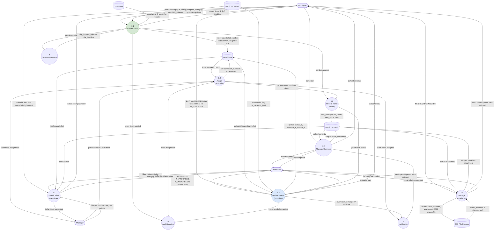
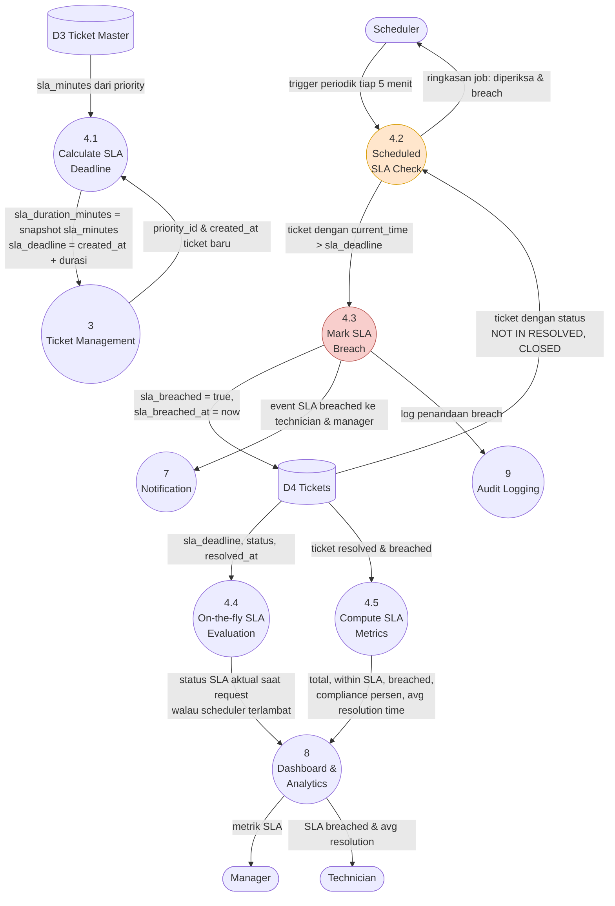
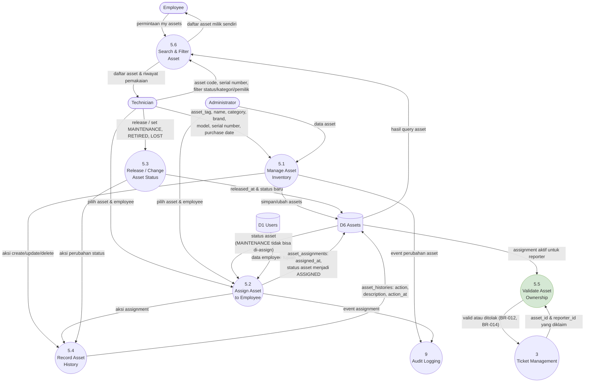
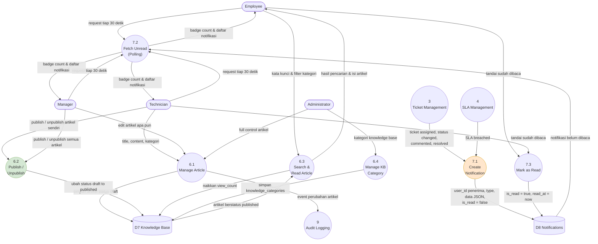

# DATA FLOW DIAGRAM (DFD)

## JARVIS OPS — IT Service Management System

**Version:** 1.0
**Sumber:** `docs/product/PRD.md` (PRD v1.0 + Addendum v1.1), `docs/schema.sql`
**Dokumen terkait:** `docs/architecture/CONTEXT-DIAGRAM.md`, `docs/architecture/ERD.md`, `docs/architecture/BACKEND-ARCHITECTURE.md`

---

## 1. Notasi

| Simbol            | Arti                                                                 |
| ----------------- | -------------------------------------------------------------------- |
| Lingkaran / oval  | Proses (process) — diberi nomor hierarkis (1, 1.1, 1.1.1)             |
| Persegi           | External entity (Employee, Technician, Manager, Admin, Scheduler)     |
| Bentuk terbuka    | Data store (D1, D2, …) — merepresentasikan tabel/kelompok tabel MySQL |
| Panah             | Aliran data                                                          |

---

## 2. Daftar Proses (Level 1)

| No | Proses                          | Modul PRD  | Ringkasan                                                             |
| -- | ------------------------------- | ---------- | --------------------------------------------------------------------- |
| 1  | Authentication & Authorization  | 6.1        | Login, logout, session/token, RBAC, permission validation             |
| 2  | User & Master Data Management   | 6.1 / 30   | User, role, department, ticket category, priority & SLA config        |
| 3  | Ticket Management               | 6.2 / 7-12 | Create, view, update, assign, status workflow, comment, attachment    |
| 4  | SLA Management                  | 6.5 / 13   | Hitung deadline, scheduled check, penandaan breach, on-the-fly calc   |
| 5  | Asset Management                | 6.3 / 15-17| Asset CRUD, assignment, asset history, validasi kepemilikan           |
| 6  | Knowledge Base Management       | 6.4 / 18-19| Article CRUD, kategori, draft/publish, search                         |
| 7  | Notification Management         | 6.6 / 22   | Buat notifikasi database, unread count, polling, mark as read         |
| 8  | Dashboard & Analytics           | 6.5 / 20-21| Statistik ticket, SLA, tren, performa technician, statistik asset      |
| 9  | Audit Logging                   | 6.7 / 23   | Catat aktivitas penting: user, action, entity, timestamp, metadata    |

---

## 3. Daftar Data Store

| Kode | Data Store           | Tabel MySQL (`docs/schema.sql`)                                              |
| ---- | -------------------- | ----------------------------------------------------------------------- |
| D1   | Users                | `users`, `employee_profiles`                                            |
| D2   | Roles & Departments  | `roles`, `departments`                                                  |
| D3   | Ticket Master        | `ticket_categories`, `ticket_priorities`, `ticket_statuses`              |
| D4   | Tickets              | `tickets`                                                               |
| D5   | Ticket Detail        | `ticket_comments`, `ticket_attachments`, `ticket_histories`              |
| D6   | Assets               | `assets`, `asset_assignments`, `asset_histories`                        |
| D7   | Knowledge Base       | `knowledge_categories`, `knowledge_articles`                            |
| D8   | Notifications        | `notifications`                                                         |
| D9   | Audit Logs           | `audit_logs`                                                            |
| D10  | File Storage         | Laravel Storage (filesystem lokal/public; object storage = future)      |

---

## 4. DFD Level 1

```mermaid
flowchart TB
    %% External entities
    EMP(["Employee"])
    TECH(["Technician"])
    MGR(["Manager"])
    ADM(["Administrator"])
    SCH(["Scheduler"])

    %% Processes
    P1(("1<br/>Authentication &<br/>Authorization"))
    P2(("2<br/>User & Master<br/>Data Management"))
    P3(("3<br/>Ticket<br/>Management"))
    P4(("4<br/>SLA<br/>Management"))
    P5(("5<br/>Asset<br/>Management"))
    P6(("6<br/>Knowledge Base<br/>Management"))
    P7(("7<br/>Notification<br/>Management"))
    P8(("8<br/>Dashboard &<br/>Analytics"))
    P9(("9<br/>Audit<br/>Logging"))

    %% Data stores
    D1[("D1 Users")]
    D2[("D2 Roles &<br/>Departments")]
    D3[("D3 Ticket Master")]
    D4[("D4 Tickets")]
    D5[("D5 Ticket Detail")]
    D6[("D6 Assets")]
    D7[("D7 Knowledge Base")]
    D8[("D8 Notifications")]
    D9[("D9 Audit Logs")]
    D10[("D10 File Storage")]

    %% ---- Authentication
    EMP -->|credential| P1
    TECH -->|credential| P1
    MGR -->|credential| P1
    ADM -->|credential| P1
    P1 -->|verifikasi email & password hash| D1
    D1 -->|data user, status aktif| P1
    P1 -->|role & permission| D2
    D2 -->|definisi role| P1
    P1 -->|auth token / sesi| EMP
    P1 -->|auth token / sesi| TECH
    P1 -->|auth token / sesi| MGR
    P1 -->|auth token / sesi| ADM
    P1 -->|update last_login_at| D1
    P1 -->|event login/logout| P9

    %% ---- Master data
    ADM -->|data user, role, department,<br/>kategori, priority & SLA| P2
    P2 -->|simpan user & employee profile| D1
    P2 -->|simpan role & department| D2
    P2 -->|simpan kategori, priority, status| D3
    D3 -->|master data| P2
    P2 -->|konfirmasi & daftar master data| ADM
    P2 -->|event perubahan konfigurasi| P9

    %% ---- Ticket
    EMP -->|data ticket baru, komentar,<br/>attachment, konfirmasi selesai| P3
    TECH -->|update status, note, attachment,<br/>perubahan priority| P3
    MGR -->|assignment technician, priority| P3
    P3 -->|ticket & status| D4
    D4 -->|data ticket| P3
    P3 -->|komentar, attachment metadata, histori| D5
    D5 -->|detail ticket| P3
    P3 -->|simpan file| D10
    D10 -->|file terverifikasi| P3
    D3 -->|kategori, priority, sla_minutes, status| P3
    P3 -->|validasi asset milik reporter| P5
    P5 -->|asset valid / ditolak| P3
    P3 -->|permintaan hitung SLA deadline| P4
    P4 -->|sla_duration_minutes & sla_deadline| P3
    P3 -->|event ticket assigned / status changed /<br/>commented / resolved| P7
    P3 -->|event perubahan ticket| P9
    P3 -->|nomor & status ticket, detail, histori| EMP
    P3 -->|daftar ticket assigned, detail| TECH
    P3 -->|seluruh data ticket| MGR

    %% ---- SLA
    SCH -->|trigger setiap 5 menit| P4
    P4 -->|baca ticket aktif & deadline| D4
    P4 -->|set sla_breached, sla_breached_at| D4
    P4 -->|event SLA breached| P7
    P4 -->|event SLA breached| P9
    P4 -->|ringkasan hasil job| SCH

    %% ---- Asset
    TECH -->|data asset & assignment| P5
    ADM -->|data asset & assignment| P5
    P5 -->|simpan asset, assignment, history| D6
    D6 -->|data asset, assignment aktif| P5
    P5 -->|daftar asset & histori| TECH
    P5 -->|daftar asset milik sendiri| EMP
    P5 -->|event perubahan asset| P9
    D1 -->|data pemilik asset| P5

    %% ---- Knowledge base
    TECH -->|draft, edit, publish artikel| P6
    MGR -->|edit, unpublish, delete artikel| P6
    ADM -->|kelola artikel & kategori| P6
    EMP -->|kata kunci pencarian| P6
    P6 -->|simpan artikel & kategori| D7
    D7 -->|artikel & kategori| P6
    P6 -->|artikel published, hasil pencarian| EMP
    P6 -->|artikel & statistik view| TECH
    P6 -->|event perubahan artikel| P9

    %% ---- Notification
    P7 -->|simpan notifikasi| D8
    D8 -->|notifikasi belum dibaca| P7
    EMP -->|polling & mark as read| P7
    TECH -->|polling & mark as read| P7
    MGR -->|polling & mark as read| P7
    ADM -->|polling & mark as read| P7
    P7 -->|daftar notifikasi & unread count| EMP
    P7 -->|daftar notifikasi & unread count| TECH
    P7 -->|daftar notifikasi & unread count| MGR
    P7 -->|daftar notifikasi & unread count| ADM

    %% ---- Dashboard
    EMP -->|permintaan dashboard| P8
    TECH -->|permintaan dashboard| P8
    MGR -->|permintaan dashboard, filter periode| P8
    ADM -->|permintaan dashboard| P8
    D4 -->|agregasi ticket & SLA| P8
    D5 -->|data histori untuk resolution time| P8
    D6 -->|statistik asset| P8
    D1 -->|jumlah user & technician| P8
    D7 -->|artikel terbaru| P8
    P4 -->|status SLA on-the-fly| P8
    P8 -->|dashboard employee| EMP
    P8 -->|dashboard technician| TECH
    P8 -->|dashboard & laporan manager| MGR
    P8 -->|dashboard admin & statistik sistem| ADM

    %% ---- Audit
    P9 -->|simpan log aktivitas| D9
    D9 -->|riwayat aktivitas| P9
    P9 -->|audit log lengkap| ADM
    P9 -->|audit log terbatas| MGR

    style P3 fill:#dae8fc,stroke:#6c8ebf
    style P4 fill:#ffe6cc,stroke:#d79b00
```



---

## 5. DFD Level 2 — Proses 3 (Ticket Management)



### Business rule yang dikawal proses 3

| Rule    | Proses | Penerapan                                                                     |
| ------- | ------ | ----------------------------------------------------------------------------- |
| BR-001  | 3.1    | `reporter_id` wajib diisi dari user terautentikasi                            |
| BR-002  | 3.1    | Status awal otomatis `OPEN`                                                   |
| BR-003  | 3.1    | `technician_id` nullable saat pembuatan                                       |
| BR-004  | 3.2    | Hanya Manager/Admin yang dapat melakukan assignment                           |
| BR-005  | 3.3    | Technician hanya memproses ticket yang di-assign kepadanya                     |
| BR-006  | 3.1    | `priority_id` wajib                                                           |
| BR-007  | 3.1    | `category_id` wajib                                                           |
| BR-008  | 3.6    | Setiap perubahan status dicatat ke `ticket_histories`                          |
| BR-009  | 3.3    | Ticket `CLOSED` tidak dapat dimodifikasi Employee                             |
| BR-010  | 3.1–3.5| Setiap perubahan penting dikirim ke proses 9 (audit log)                       |
| BR-011  | 3.1    | Asset bersifat optional                                                       |
| BR-012  | 3.1    | Employee hanya dapat memilih asset yang di-assign kepadanya                    |
| BR-013  | 3.1    | Asset harus valid dan terdaftar                                               |
| BR-014  | 3.1    | Validasi kepemilikan asset dilakukan di backend, bukan filter frontend         |
| BR-015  | —      | `tickets.asset_id` memakai `ON DELETE SET NULL` sehingga histori ticket tetap  |

---

## 6. DFD Level 2 — Proses 4 (SLA Management)



### Aturan SLA

```text
sla_deadline = created_at + sla_duration_minutes

SLA BREACHED bila:
    current_time > sla_deadline
    AND status NOT IN (RESOLVED, CLOSED)

SLA Compliance = (Tickets Resolved Within SLA / Total Resolved Tickets) x 100
```

Proses 4.1 menyimpan **snapshot** `sla_duration_minutes` pada ticket agar perubahan konfigurasi
priority oleh Admin tidak mengubah SLA ticket lama. Proses 4.4 berfungsi sebagai *defensive
mechanism*: dashboard tetap akurat meskipun scheduler tertunda.

---

## 7. DFD Level 2 — Proses 5 (Asset Management)



Riwayat kepemilikan asset diperoleh dari `asset_assignments` (bukan hanya kolom pemilik saat ini),
sehingga rantai pemakaian seperti `Laptop A → Andi (2025) → Budi (2026) → Citra (current)` dapat
direkonstruksi.

---

## 8. DFD Level 2 — Proses 6 (Knowledge Base) & Proses 7 (Notification)



Penerima notifikasi per event (Addendum §4.4):

| Event                 | Penerima                       |
| --------------------- | ------------------------------ |
| Ticket Assigned       | Technician                     |
| Ticket Status Changed | Reporter dan/atau Technician   |
| Ticket Commented      | Peserta ticket terkait         |
| Ticket Resolved       | Reporter                       |
| SLA Breached          | Assigned Technician + Manager  |

---

## 9. Ringkasan Proses vs Data Store (CRUD Matrix)

| Data Store            | P1 | P2 | P3 | P4 | P5 | P6 | P7 | P8 | P9 |
| --------------------- | -- | -- | -- | -- | -- | -- | -- | -- | -- |
| D1 Users              | RU | CRUD | R | –  | R  | R  | R  | R  | R  |
| D2 Roles & Depts      | R  | CRUD | R | –  | –  | –  | –  | R  | –  |
| D3 Ticket Master      | –  | CRUD | R | R  | –  | –  | –  | R  | –  |
| D4 Tickets            | –  | –  | CRUD | RU | R | –  | R  | R  | R  |
| D5 Ticket Detail      | –  | –  | CRD | –  | –  | –  | R  | R  | R  |
| D6 Assets             | –  | –  | R  | –  | CRUD | – | –  | R  | R  |
| D7 Knowledge Base     | –  | –  | –  | –  | –  | CRUD | – | R  | R  |
| D8 Notifications      | –  | –  | –  | –  | –  | –  | CRU | – | –  |
| D9 Audit Logs         | –  | –  | –  | –  | –  | –  | –  | R  | CR |
| D10 File Storage      | –  | –  | CR | –  | –  | –  | –  | –  | –  |

Keterangan: C = Create, R = Read, U = Update, D = Delete (soft delete pada tabel bertanda
`deleted_at`), – = tidak ada akses.
