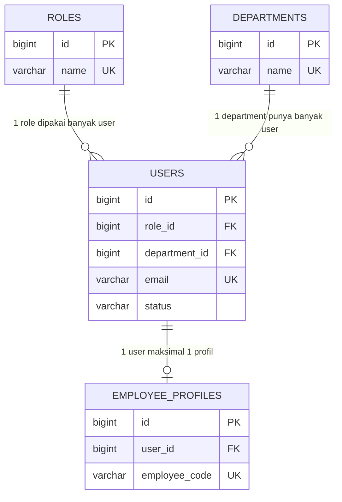
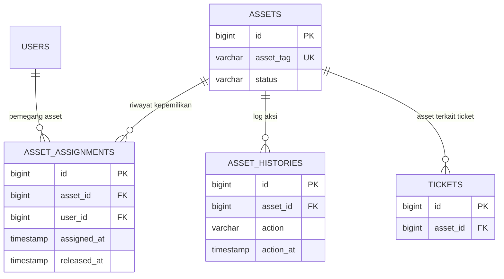
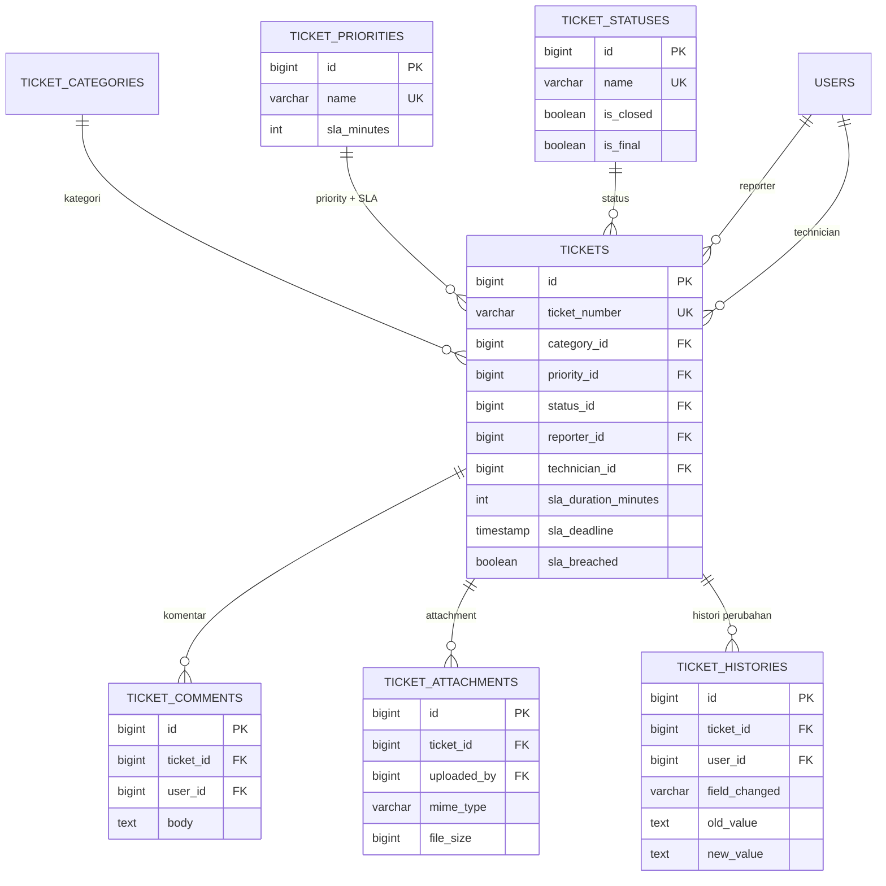
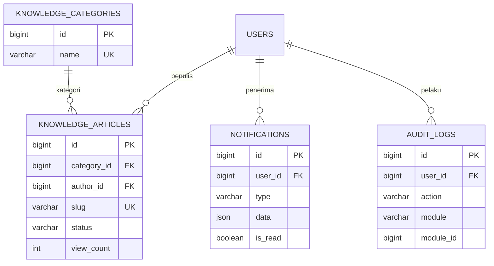

# ENTITY RELATIONSHIP DIAGRAM (ERD)

## JARVIS OPS — IT Service Management System

**Version:** 1.2
**Database:** MySQL
**Sumber:** `docs/product/PRD.md` (PRD v1.0 + Addendum v1.1), `docs/schema.sql`, `DECISIONS.md` Bagian A
**Dokumen terkait:** `docs/architecture/CONTEXT-DIAGRAM.md`, `docs/architecture/DFD.md`

---

## 1. Daftar Entitas

| No | Tabel                  | Kelompok        | Keterangan                                              |
| -- | ---------------------- | --------------- | ------------------------------------------------------- |
| 1  | `roles`                | Identity        | Employee, Technician, Manager, Admin                    |
| 2  | `departments`          | Identity        | Unit organisasi                                         |
| 3  | `users`                | Identity        | Akun pengguna (dibuat Admin/seeder, tanpa self-register) |
| 4  | `employee_profiles`    | Identity        | Data kepegawaian 1–1 dengan user                        |
| 5  | `assets`               | Asset           | Inventaris perangkat IT                                 |
| 6  | `asset_assignments`    | Asset           | Riwayat & assignment aktif asset ke user                |
| 7  | `asset_histories`      | Asset           | Log aksi pada asset                                     |
| 8  | `ticket_categories`    | Ticket Master   | Hardware, Software, Network, Account, Other             |
| 9  | `ticket_priorities`    | Ticket Master   | Critical/High/Medium/Low + `sla_minutes`                |
| 10 | `ticket_statuses`      | Ticket Master   | OPEN, ASSIGNED, IN_PROGRESS, RESOLVED, CLOSED           |
| 11 | `tickets`              | Ticket          | Core entity                                             |
| 12 | `ticket_comments`      | Ticket          | Komentar & troubleshooting note                         |
| 13 | `ticket_attachments`   | Ticket          | Metadata file (maks 5 MB; JPG/JPEG/PNG/PDF)             |
| 14 | `ticket_histories`     | Ticket          | Audit perubahan field per ticket                        |
| 15 | `knowledge_categories` | Knowledge Base  | Kategori artikel                                        |
| 16 | `knowledge_articles`   | Knowledge Base  | Artikel troubleshooting (draft/published)               |
| 17 | `notifications`        | Support         | In-app notification berbasis database                   |
| 18 | `audit_logs`           | Support         | Log aktivitas sistem lintas modul                       |

---

## 2. ERD Lengkap

```mermaid
erDiagram
    ROLES ||--o{ USERS : "memiliki"
    DEPARTMENTS ||--o{ USERS : "menaungi"
    USERS ||--o| EMPLOYEE_PROFILES : "memiliki profil"

    ASSETS ||--o{ ASSET_ASSIGNMENTS : "dialokasikan melalui"
    USERS ||--o{ ASSET_ASSIGNMENTS : "menerima"
    ASSETS ||--o{ ASSET_HISTORIES : "mencatat"

    TICKET_CATEGORIES ||--o{ TICKETS : "mengklasifikasikan"
    TICKET_PRIORITIES ||--o{ TICKETS : "menentukan SLA"
    TICKET_STATUSES ||--o{ TICKETS : "menyatakan status"
    USERS ||--o{ TICKETS : "melaporkan"
    USERS ||--o{ TICKETS : "menangani"
    DEPARTMENTS ||--o{ TICKETS : "terkait"
    ASSETS ||--o{ TICKETS : "dirujuk oleh"

    TICKETS ||--o{ TICKET_COMMENTS : "memiliki"
    USERS ||--o{ TICKET_COMMENTS : "menulis"
    TICKETS ||--o{ TICKET_ATTACHMENTS : "memiliki"
    USERS ||--o{ TICKET_ATTACHMENTS : "mengunggah"
    TICKETS ||--o{ TICKET_HISTORIES : "mencatat"
    USERS ||--o{ TICKET_HISTORIES : "melakukan"

    KNOWLEDGE_CATEGORIES ||--o{ KNOWLEDGE_ARTICLES : "mengelompokkan"
    USERS ||--o{ KNOWLEDGE_ARTICLES : "menulis"

    USERS ||--o{ NOTIFICATIONS : "menerima"
    USERS ||--o{ AUDIT_LOGS : "menghasilkan"

    ROLES {
        bigint id PK
        varchar name UK "Employee, Technician, Manager, Admin"
        varchar description
        timestamp created_at
        timestamp updated_at
        timestamp deleted_at
    }

    DEPARTMENTS {
        bigint id PK
        varchar name UK
        varchar description
        timestamp created_at
        timestamp updated_at
        timestamp deleted_at
    }

    USERS {
        bigint id PK
        bigint role_id FK "NOT NULL"
        bigint department_id FK "NULL, ON DELETE SET NULL"
        varchar email UK "NOT NULL"
        varchar password "hashed"
        varchar full_name "NOT NULL"
        varchar status "active / inactive (BR-019)"
        timestamp last_login_at
        timestamp created_at
        timestamp updated_at
        timestamp deleted_at
    }

    EMPLOYEE_PROFILES {
        bigint id PK
        bigint user_id FK "UNIQUE, ON DELETE CASCADE"
        varchar employee_code UK
        varchar phone
        varchar position
        date hire_date
        timestamp created_at
        timestamp updated_at
        timestamp deleted_at
    }

    ASSETS {
        bigint id PK
        varchar asset_tag UK "AST-LTP-001"
        varchar name "NOT NULL"
        varchar category "Laptop, Monitor, Router, dll"
        varchar brand
        varchar model
        varchar serial_number UK
        date purchase_date
        varchar status "available, assigned, maintenance, retired, lost"
        text notes
        timestamp created_at
        timestamp updated_at
        timestamp deleted_at
    }

    ASSET_ASSIGNMENTS {
        bigint id PK
        bigint asset_id FK "NOT NULL"
        bigint user_id FK "NOT NULL"
        timestamp assigned_at "NOT NULL"
        timestamp released_at "NULL = assignment aktif"
        text notes
        timestamp created_at
        timestamp updated_at
        timestamp deleted_at
    }

    ASSET_HISTORIES {
        bigint id PK
        bigint asset_id FK "NOT NULL"
        varchar action "created, assigned, released, status_changed"
        text description
        timestamp action_at "NOT NULL"
        timestamp created_at
    }

    TICKET_CATEGORIES {
        bigint id PK
        varchar name UK "Hardware, Software, Network, Account, Other"
        varchar description
        timestamp created_at
        timestamp updated_at
        timestamp deleted_at
    }

    TICKET_PRIORITIES {
        bigint id PK
        varchar name UK "Critical, High, Medium, Low"
        int sla_minutes "120, 240, 480, 1440"
        varchar description
        timestamp created_at
        timestamp updated_at
        timestamp deleted_at
    }

    TICKET_STATUSES {
        bigint id PK
        varchar name UK "OPEN, ASSIGNED, IN_PROGRESS, RESOLVED, CLOSED"
        varchar description
        boolean is_closed "menghentikan hitungan SLA"
        boolean is_final "status akhir lifecycle"
        timestamp created_at
        timestamp updated_at
        timestamp deleted_at
    }

    TICKETS {
        bigint id PK
        varchar ticket_number UK "TCK-0001"
        bigint category_id FK "NOT NULL (BR-007)"
        bigint priority_id FK "NOT NULL (BR-006)"
        bigint status_id FK "NOT NULL, default OPEN (BR-002)"
        bigint reporter_id FK "NOT NULL (BR-001)"
        bigint technician_id FK "NULL (BR-003), ON DELETE SET NULL"
        bigint department_id FK "NULL, ON DELETE SET NULL"
        bigint asset_id FK "NULL (BR-011), ON DELETE SET NULL (BR-015)"
        varchar title "NOT NULL"
        text description "NOT NULL"
        int sla_duration_minutes "snapshot dari priority"
        timestamp sla_deadline "created_at + sla_duration_minutes"
        timestamp resolved_at
        timestamp closed_at
        boolean sla_breached "default false"
        timestamp sla_breached_at
        timestamp created_at
        timestamp updated_at
        timestamp deleted_at
    }

    TICKET_COMMENTS {
        bigint id PK
        bigint ticket_id FK "ON DELETE CASCADE"
        bigint user_id FK "NOT NULL"
        text body "NOT NULL"
        timestamp created_at
        timestamp updated_at
        timestamp deleted_at
    }

    TICKET_ATTACHMENTS {
        bigint id PK
        bigint ticket_id FK "ON DELETE CASCADE"
        bigint uploaded_by FK "NOT NULL"
        varchar original_filename
        varchar stored_filename
        varchar mime_type "image/jpeg, image/png, application/pdf"
        bigint file_size "maks 5242880 byte"
        varchar storage_path
        timestamp created_at
    }

    TICKET_HISTORIES {
        bigint id PK
        bigint ticket_id FK "ON DELETE CASCADE"
        bigint user_id FK "NOT NULL"
        varchar field_changed "status_id, technician_id, priority_id"
        text old_value
        text new_value
        timestamp created_at
    }

    KNOWLEDGE_CATEGORIES {
        bigint id PK
        varchar name UK
        varchar description
        timestamp created_at
        timestamp updated_at
        timestamp deleted_at
    }

    KNOWLEDGE_ARTICLES {
        bigint id PK
        bigint category_id FK "NOT NULL"
        bigint author_id FK "NOT NULL"
        varchar title "NOT NULL"
        varchar slug UK
        longtext content "NOT NULL"
        varchar status "draft / published"
        int view_count "default 0"
        timestamp created_at
        timestamp updated_at
        timestamp deleted_at
    }

    NOTIFICATIONS {
        bigint id PK
        bigint user_id FK "ON DELETE CASCADE"
        varchar type "ticket_assigned, status_changed, commented, resolved, sla_breached"
        json data "payload notifikasi"
        boolean is_read "default false"
        timestamp read_at
        timestamp created_at
        timestamp updated_at
    }

    AUDIT_LOGS {
        bigint id PK
        bigint user_id FK "NULL, ON DELETE SET NULL"
        varchar action "created, updated, deleted, assigned, login"
        varchar module "tickets, assets, users, articles"
        bigint module_id
        json old_data
        json new_data
        varchar ip_address
        text user_agent
        timestamp created_at
    }
```

---

## 3. ERD per Modul

### 3.1 Identity & Organization

Role disimpan sebagai tabel referensi (bukan enum) agar Admin dapat mengelolanya sesuai US-016.
`users.status` memisahkan akun aktif/nonaktif tanpa menghapus data historis ticket.

### 3.2 Asset Management

Relasi asset–user dibuat many-to-many bertingkat lewat `asset_assignments`, bukan kolom
`assigned_user_id` di `assets`. Konsekuensinya:

- assignment aktif = baris dengan `released_at IS NULL`;
- riwayat pemakaian lintas tahun tetap tersimpan (kebutuhan §17 PRD);
- validasi BR-012 dijalankan dengan mencari assignment aktif milik reporter.

### 3.3 Ticketing

`users` dirujuk dua kali oleh `tickets` (`reporter_id` dan `technician_id`) — relasi ganda yang
perlu alias eksplisit pada Eloquent (`reporter()`, `technician()`).

### 3.4 Knowledge Base, Notification & Audit

`audit_logs` memakai pola polymorphic sederhana (`module` + `module_id`) tanpa foreign key ke
tabel target, agar log tetap ada meskipun entitas asalnya dihapus.

---

## 4. Ringkasan Relasi & Kardinalitas

| No | Relasi                                       | Kardinalitas | FK                                | On Delete   |
| -- | -------------------------------------------- | ------------ | --------------------------------- | ----------- |
| 1  | roles → users                                | 1 : N        | `users.role_id`                   | RESTRICT    |
| 2  | departments → users                          | 1 : N (opt)  | `users.department_id`             | SET NULL    |
| 3  | users → employee_profiles                    | 1 : 1 (opt)  | `employee_profiles.user_id` (UK)  | CASCADE     |
| 4  | assets → asset_assignments                   | 1 : N        | `asset_assignments.asset_id`      | RESTRICT    |
| 5  | users → asset_assignments                    | 1 : N        | `asset_assignments.user_id`       | RESTRICT    |
| 6  | assets → asset_histories                     | 1 : N        | `asset_histories.asset_id`        | RESTRICT    |
| 7  | ticket_categories → tickets                  | 1 : N        | `tickets.category_id`             | RESTRICT    |
| 8  | ticket_priorities → tickets                  | 1 : N        | `tickets.priority_id`             | RESTRICT    |
| 9  | ticket_statuses → tickets                    | 1 : N        | `tickets.status_id`               | RESTRICT    |
| 10 | users (reporter) → tickets                   | 1 : N        | `tickets.reporter_id`             | RESTRICT    |
| 11 | users (technician) → tickets                 | 1 : N (opt)  | `tickets.technician_id`           | SET NULL    |
| 12 | departments → tickets                        | 1 : N (opt)  | `tickets.department_id`           | SET NULL    |
| 13 | assets → tickets                             | 1 : N (opt)  | `tickets.asset_id`                | SET NULL    |
| 14 | tickets → ticket_comments                    | 1 : N        | `ticket_comments.ticket_id`       | CASCADE     |
| 15 | users → ticket_comments                      | 1 : N        | `ticket_comments.user_id`         | RESTRICT    |
| 16 | tickets → ticket_attachments                 | 1 : N        | `ticket_attachments.ticket_id`    | CASCADE     |
| 17 | users → ticket_attachments                   | 1 : N        | `ticket_attachments.uploaded_by`  | RESTRICT    |
| 18 | tickets → ticket_histories                   | 1 : N        | `ticket_histories.ticket_id`      | CASCADE     |
| 19 | users → ticket_histories                     | 1 : N        | `ticket_histories.user_id`        | RESTRICT    |
| 20 | knowledge_categories → knowledge_articles    | 1 : N        | `knowledge_articles.category_id`  | RESTRICT    |
| 21 | users → knowledge_articles                   | 1 : N        | `knowledge_articles.author_id`    | RESTRICT    |
| 22 | users → notifications                        | 1 : N        | `notifications.user_id`           | CASCADE     |
| 23 | users → audit_logs                           | 1 : N (opt)  | `audit_logs.user_id`              | SET NULL    |

---

## 5. Keputusan Desain Database

1. **Snapshot SLA pada ticket.** `sla_duration_minutes` dan `sla_deadline` disimpan di `tickets`,
   bukan dihitung ulang dari `ticket_priorities`. Perubahan konfigurasi SLA oleh Admin tidak
   mengubah target ticket lama.
2. **Master data sebagai tabel, bukan enum.** `ticket_categories`, `ticket_priorities`,
   `ticket_statuses`, `roles`, `departments` dikelola Admin melalui UI (US-016 s.d. US-019),
   sehingga harus berupa tabel referensi.
3. **`tickets.asset_id` nullable + `ON DELETE SET NULL`.** Memenuhi BR-011 dan BR-015: asset
   opsional, dan penghapusan asset tidak menghapus ticket.
4. **`asset_assignments` sebagai tabel riwayat.** Assignment aktif ditentukan oleh
   `released_at IS NULL`; riwayat lengkap tetap tersimpan.
5. **Soft delete.** Tabel entitas utama memiliki `deleted_at`; tabel log murni
   (`asset_histories`, `ticket_attachments`, `ticket_histories`, `audit_logs`) hanya `created_at`
   karena bersifat append-only.
6. **Notifikasi berbasis database + JSON payload.** Sesuai Addendum §4: tidak ada WebSocket pada
   MVP; frontend melakukan polling. `data` bertipe JSON agar tiap tipe notifikasi bisa membawa
   struktur berbeda tanpa perubahan skema.
7. **`audit_logs.user_id` nullable.** Log tetap dapat dibaca setelah user dihapus.
8. **Metadata attachment terpisah dari file fisik.** Tabel hanya menyimpan
   `stored_filename`/`storage_path`; validasi MIME, ekstensi, dan ukuran maks 5 MB dilakukan
   backend, dan akses file dikontrol otorisasi ticket (Addendum §6.5).

---

## 6. Index Pendukung Query

| Index                          | Tabel & Kolom                         | Kegunaan                                     |
| ------------------------------ | ------------------------------------- | -------------------------------------------- |
| `idx_users_role`               | `users(role_id)`                      | Filter user per role, hitung total technician |
| `idx_users_department`         | `users(department_id)`                | Statistik per department                     |
| `idx_assets_status`            | `assets(status)`                      | Filter asset available/maintenance           |
| `idx_asset_assignments_user`   | `asset_assignments(user_id)`          | My assets, validasi BR-012                   |
| `idx_asset_assignments_asset`  | `asset_assignments(asset_id)`         | Riwayat pemakaian asset                      |
| `idx_tickets_status`           | `tickets(status_id)`                  | Filter & dashboard per status                |
| `idx_tickets_priority`         | `tickets(priority_id)`                | Tickets by priority                          |
| `idx_tickets_category`         | `tickets(category_id)`                | Tickets by category                          |
| `idx_tickets_reporter`         | `tickets(reporter_id)`                | My tickets                                   |
| `idx_tickets_technician`       | `tickets(technician_id)`              | Assigned tickets, performa technician        |
| `idx_tickets_department`       | `tickets(department_id)`              | Laporan per department                       |
| `idx_tickets_asset`            | `tickets(asset_id)`                   | Ticket terkait asset tertentu                |
| `idx_tickets_sla`              | `tickets(sla_breached, sla_deadline)` | Scheduled SLA check tiap 5 menit             |
| `idx_notifications_user_read`  | `notifications(user_id, is_read)`     | Polling unread count                         |
| `idx_audit_logs_module`        | `audit_logs(module, module_id)`       | Audit trail per entitas                      |
| `idx_knowledge_articles_status`| `knowledge_articles(status)`          | Daftar artikel published untuk employee      |

---

## 7. Referensi Skema Fisik

DDL lengkap (tipe kolom, constraint, index) tersedia di `docs/schema.sql` pada root repository.
Dokumen ini merupakan representasi konseptual/logis dari skema tersebut; bila terjadi perbedaan,
`docs/schema.sql` adalah acuan implementasi.
